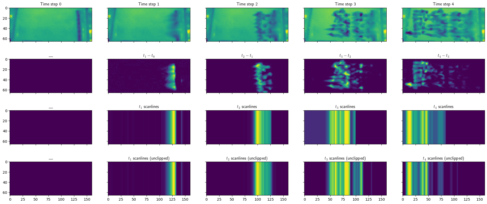

# gel-scanlines

Inspired by a [tweet](https://twitter.com/HannahRaeThomas/status/1353757699025104905)
from Hannah Thomas about watching her gel electrophoresis run over Zoom,
a little proof of concept exploring how you might automate this.

> [`scanlines_plots.png`](scanlines_plots.png) generated by [`gel_scan.py`](gel_scan.py)

You might use a `tqdm` progress bar tied to the ratio of the way along the gel frontier
is, as annotated by the kind of [scanlines](https://en.wikipedia.org/wiki/Scan_line)
approach shown above, and clipping away the previous time point's
frontier position as shown in the 3rd row.

Scanlines are like taking a spectrum of intensity (black pixels are lower values, so
after increasing the contrast you invert the values and take the maximum per column).

At each time step, you can assign a 'frontier' and then store that, ignoring any points behind
that last step's frontier when you assign the frontier to the new step.

The bottom row of plots shows what the scanlines would look like without clipping away the
previous frontier ("unclipped").

There are no doubt better ways to do this, I've not really thought about the problem before,
thoughts welcome in issues/pull requests!

## More ideas

Since a gel plot photo will have (by design) peaks all the way along, it's more accurate to
say the scanlines are a multimodal distribution. In fact, you want them to be sharp peaks,
so that should make the distribution quite nice to work with in a Gaussian mixture model?
